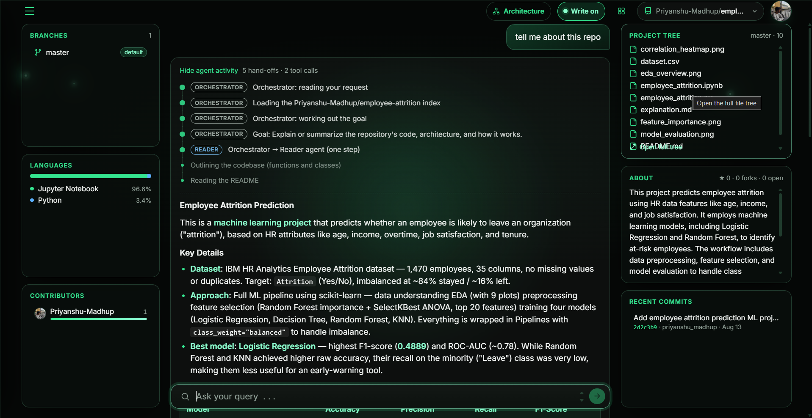
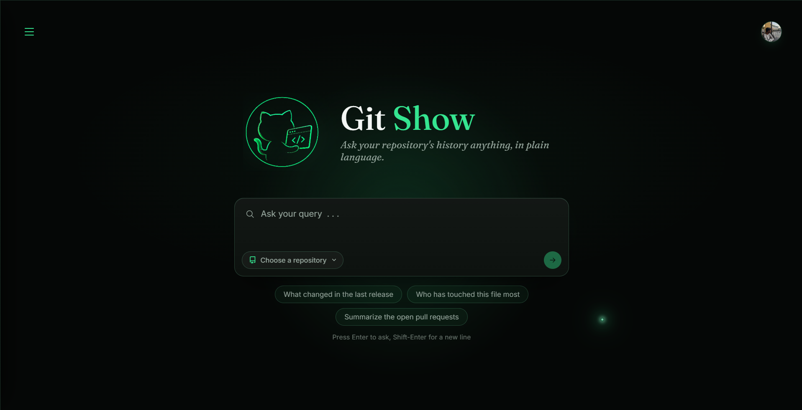
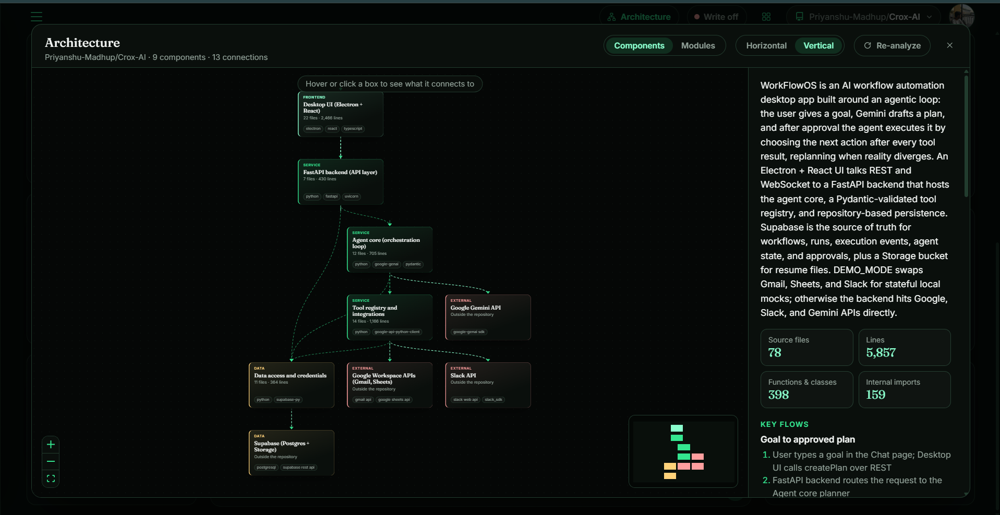
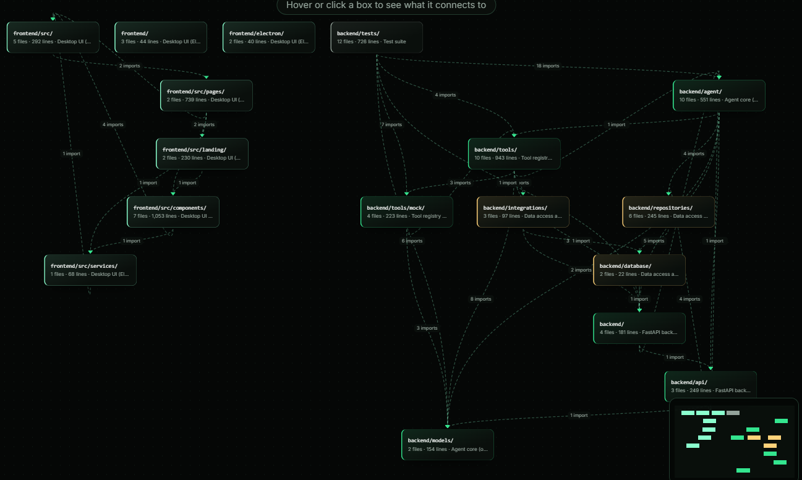

<p align="center">
  
</p>

<h1 align="center">Git Show</h1>

<p align="center">
  <em>Ask your repository's history anything, in plain language.</em><br>
  A chat assistant for GitHub that answers questions about your code and, when you ask, makes changes, but only after you confirm them.
</p>

<p align="center">
  
  
  
  
</p>

<p align="center">
  
</p>

## What it does

Sign in with GitHub, pick a repository, and ask about its code, history, issues, and pull requests. Ask for a change too: a branch, a file edit, a pull request, an issue, a merge. Every change is shown to you first, with the exact diff where one applies. It runs only after you press **Confirm**, and Git Show then re-reads GitHub to check that it landed.

- **Understands the whole project.** It reads a codebase outline (every class and function), the README, commits, diffs, issues and pull requests, so answers come from the real code.
- **Never changes anything silently.** Writes need your confirmation. Deleting a file or branch, or merging, gets a red warning card.
- **Remembers.** Each chat keeps a rolling summary, and the assistant can look back through your earlier chats and runs.
- **Shows its work.** A live timeline streams which agent is doing what, with each tool call and plan revision.

<p align="center">
  
</p>

## How it works

```
             user message
                  │
            ┌─────▼──────┐   works out the goal, then decides:
            │ Orchestrator│  one step, or does it need a plan?
            └─┬───┬─────┬┘
     one step │   │     │ one step
   (read-only)│   │     │ (one change)
              │   │ needs a plan
              ▼   ▼     ▼
          Reader  Planning agent  Writer ── you confirm ──▶ GitHub
             ▲      │   ▲   │                                │
             └─step─┘   │   └──step──▶ Writer                │
               result   │                                   ▼
                        └────────── result ─────────── Verifier (re-reads GitHub)
```

| Agent | Role |
|---|---|
| **Orchestrator** | Works out the goal and picks the route. It never touches GitHub itself. Its routing decisions come from [Wity](https://wity.alphanimble.com/docs) when a key is set, otherwise from the main model. |
| **Planning agent** | Owns multi-step runs. Every step has an expected outcome; if the result differs, it revises the plan. |
| **Reader** | Read-only investigation with 40 tools: repository index, file outlines, single functions, commits, diffs, issues, pull requests, and memory. It never sees a write tool. |
| **Writer** | Proposes exactly one change using 19 write tools. The proposal is validated before you see it. |
| **Verifier** | After a confirmed write, re-reads GitHub to check that the change really landed. |

### Guardrails

- Nothing changes without your confirmation, and each confirmation works once and expires after an hour.
- Identical tool calls are answered from cache and flagged, and a run pauses with a **Continue** button after 100 tool calls.
- A change aimed at a repository you didn't select is rejected.
- Cancelling a proposal ends that attempt, and the planner never re-proposes it.

## Architecture view

The **Architecture** button opens a diagram of the selected repository. One archive download gives a real import graph, and one model call groups the code into components, connections and key flows. The result is stored per repository and re-analyzed only when you ask.

<p align="center">
  
</p>

The **Modules** view shows the directory-level import graph, with no model involved.

<p align="center">
  
</p>

## Quick start

**Prerequisites:** Python 3.12+, Node.js 18+, an [OpenRouter API key](https://openrouter.ai/keys), a Supabase (or any Postgres) project, and a [GitHub App](https://github.com/settings/apps) with callback URL `http://localhost:5173/api/auth/github/callback` and Contents, Pull requests and Issues read and write permissions.

```bash
# Backend
cd backend
pip install -r requirements.txt
cp .env.example .env          # fill in real values
python db/migrate.py          # creates tables, memory views and roles
uvicorn main:app --reload --port 8000

# Frontend (in another terminal)
cd frontend
npm install
npm run dev                   # http://localhost:5173
```

Open `http://localhost:5173/app` for the chat. The full list of environment variables, deployment notes (Vercel and Render), and the API reference are in the [detailed readme](detailed_readme.md).

## Tech stack

- **Backend:** FastAPI, Postgres on Supabase (`psycopg`), OpenRouter with `qwen/qwen3.7-flash` (Gemini as an alternative provider), [Wity](https://wity.alphanimble.com/docs) for routing decisions, `cryptography` (Fernet) for encrypting GitHub tokens, and `sqlglot` for validating memory queries.
- **Frontend:** React 19, Vite, Three.js for the landing page, React Flow with dagre for the architecture diagram.

## Security

- GitHub tokens are encrypted at rest. Session cookies are httponly, SameSite=Lax, and stored only as a SHA-256 hash.
- The memory tool runs model-written SQL contained three ways: a single `SELECT` over allow-listed views, a role that can read nothing else, and a read-only transaction with a 5-second timeout.
- Every table has row-level security with no policies, so the public Supabase key can read nothing.

## Documentation

See [detailed_readme.md](detailed_readme.md) for the project structure, every endpoint, all environment variables, deployment, and known limitations.
